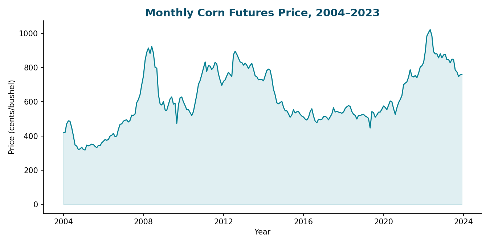
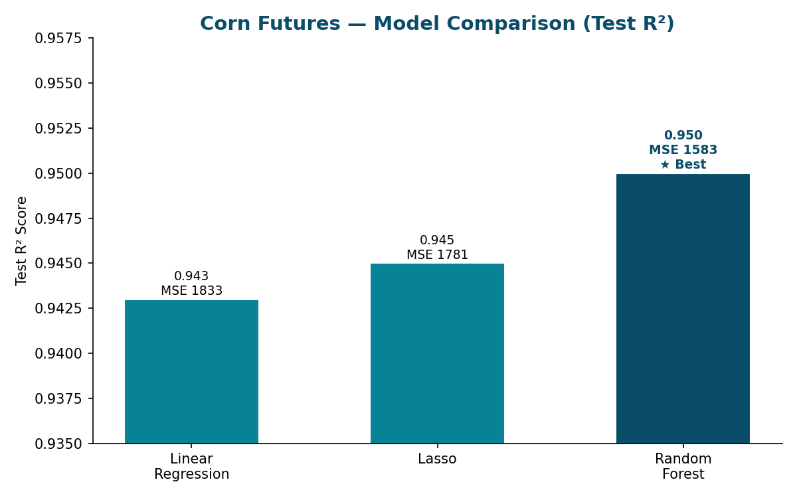
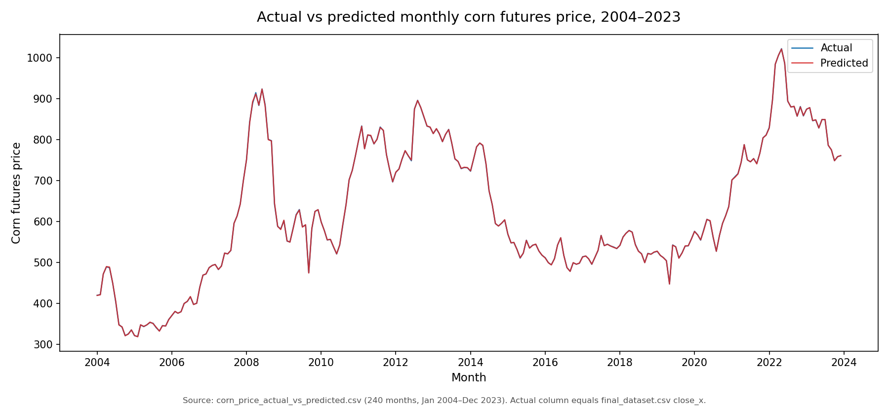
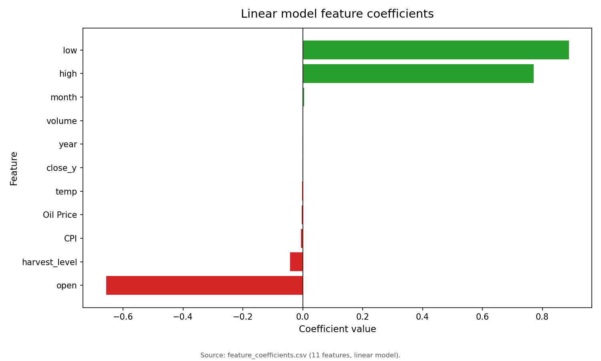
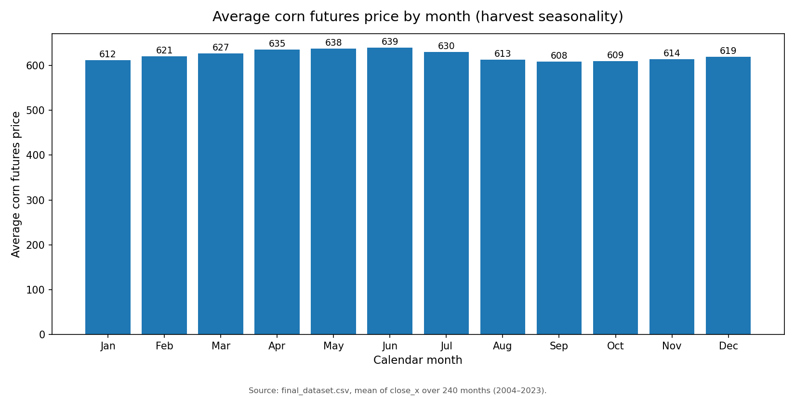

# Assessing Economic Factors in Corn Futures Price

IS 507 final project (UIUC) — predicting corn futures prices from macroeconomic
indicators and production data, comparing linear and tree-based models.

Team: Sutthana Koo-anupong, Yi-Han Huang, Yun Chiao Cheng, Zih-Yi Cao.

## Question

Which economic factors drive corn futures price fluctuations — and can we
predict them? Illinois is one of the top corn-producing states, so price
volatility matters for farmers, food producers, and consumers alike.

## Data

`data/final_dataset.csv` — 240 monthly observations (Jan 2004 – Dec 2023):

| Feature | Description |
|---|---|
| harvest_level | Corn production binned into 5 categorical levels |
| open / high / low / close | Monthly corn futures trading prices |
| volume | Trading volume |
| temp | Temperature (NOAA) |
| CPI | Consumer Price Index (BLS) |
| Export Index | U.S. corn export index (USDA) |
| Oil Price | Petroleum price (EIA) |
| S&P 500 return | Computed from index history (feature engineered in notebook) |

## Method

`notebooks/Model.ipynb` — data cleaning and imputation, feature engineering
(S&P 500 returns, harvest-level binning), then five models:

1. **Linear regression** (baseline)
2. **Ridge regression** (cross-validated α)
3. **Lasso regression** (cross-validated α — performs feature selection)
4. **Random Forest regressor**
5. **Gradient Boosting regressor**

## Results

| Model | MSE | R² |
|---|---|---|
| Linear | 1833 | 0.943 |
| Ridge | 1832 | 0.943 |
| Lasso | **1781** | 0.945 |
| Random Forest | **1583** | **0.95** |
| Gradient Boosting | 2147 | 0.933 |

Random Forest won overall. Among linear models, lasso was best — it zeroed out
S&P 500 return and harvest level entirely, showing they add nothing once oil
price, export index, and CPI are in the model.

Key drivers (consistent positive coefficients across models): **oil price**,
**export index**, and **CPI** — higher input/transport costs and inflation track
higher corn prices, exactly as economic intuition suggests.

`data/corn_price_actual_vs_predicted.csv` holds the fitted values;
`data/feature_coefficients.csv` holds the linear-model coefficients.

## Reproduce

```bash
pip install -r requirements.txt
```

Open `notebooks/Model.ipynb` — it reads `data/final_dataset.csv` with a
relative path, so run it from the repo root.

## Reports

- `reports/final_project.pdf` — final paper (hypotheses, results, discussion)
- `reports/proposal.pdf` — original project proposal

## Limitations (from the paper)

- Monthly data only; daily/real-time data would sharpen predictions.
- Gradient boosting underperformed for lack of hyperparameter tuning.
- Macro factor set could be wider (interest rates, exchange rates, policy).

## Visualizations




## More Results







